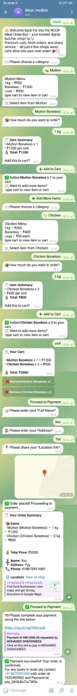
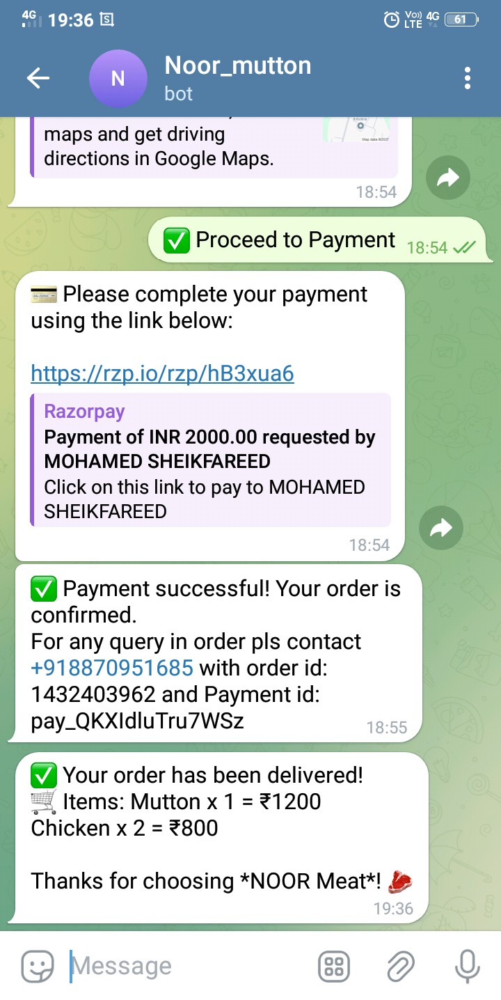
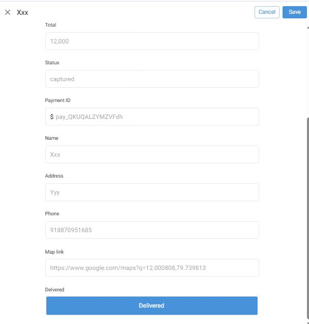

# 🐐 Noor Meat Telegram Bot
A Telegram bot built for butchery orders using Google Apps Script, Google Sheets, Razorpay, and AppSheet. Handles the full order cycle: from placing orders to delivery confirmation.

## 📦 Features
- 📲 **User Registration** via Telegram contact sharing  
- 🛍️ **Product Menu** (Mutton & Chicken categories)  
- ➕ **Cart System** with item quantity & removal  
- 💳 **Razorpay Payment** integration with webhook  
- 📋 **Order Summary & Payment Confirmation**  
- 📡 **Address & Phone Collection**  
- 🚚 **Delivery Updates** via AppSheet  
- 📩 **Telegram Notifications** to users & admins  
---

## 🧠 Tech Stack
- **Google Apps Script** – backend automation  
- **Telegram Bot API** – user interface  
- **Google Sheets** – database (Users, Orders, Cart, etc.)  
- **Razorpay** – payment collection  
- **AppSheet** – delivery tracking  
- **GitHub** – version control  
---

## 🖼️ Screenshots

